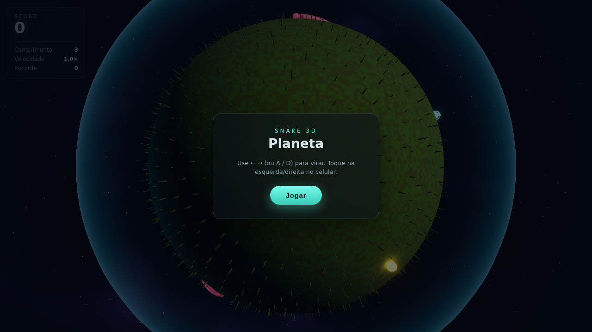

# Snake 3D 🐍🪐

Um "jogo da cobrinha" em 3D inspirado [neste vídeo](https://x.com/0xdn7/status/2062174010553901062):
a cobra desliza pela **superfície de um planeta esférico**, comendo orbes
brilhantes enquanto a câmera a segue em terceira pessoa. Feito com **Three.js**.



## Como jogar

- **← / →** ou **A / D** — virar para a esquerda / direita
- **Espaço** — **pular** (salta por cima de inimigas e do próprio corpo;
  fica brevemente invulnerável)
- **+ / −** (ou os botões **Visão**) — afastar/aproximar a câmera para ver
  mais do planeta; **[ ]** também funcionam
- **Toque** na metade esquerda/direita da tela (mobile)
- A cobra avança sozinha; você só controla a direção
- Colete as **bolas de energia amarelas** para crescer e pontuar — elas
  aparecem, ficam alguns segundos e somem; quanto maior a bola, **mais a
  cobra cresce** (proporcional à energia)
- Pegue os **power-ups**: 🛡 **escudo** (invencibilidade temporária) e
  ⚡ **turbo** (velocidade extra)
- Cuidado com as **minhocas inimigas** que vagam pelo planeta: encostar em
  uma é **game over** (o número e a velocidade delas **aumentam com o score**)
- Encostar no próprio corpo também é **game over**
- O botão 🔊 liga/desliga os **efeitos sonoros**
- No fim da partida sua pontuação entra no **placar** (ranking local; veja
  abaixo como ligar um placar online)

## Rodando localmente

```bash
npm install
npm run dev       # servidor de desenvolvimento (Vite)
```

Build estático para deploy (ex.: GitHub Pages, Netlify):

```bash
npm run build     # gera ./dist
npm run preview   # serve o build localmente
```

## Como funciona

O coração do jogo é mover-se sobre uma esfera unitária
(`src/core/SphereMath.js`):

- A cabeça tem uma **posição** (vetor unitário) e um **heading** (tangente).
- A cada frame ela avança ao longo de uma **geodésica** (grande círculo),
  rotacionando em torno do eixo `posição × heading`.
- Virar gira o heading em torno da **normal local** (a própria posição).
- O corpo é um histórico do caminho, **reamostrado** em espaçamentos de arco
  fixos para posicionar os segmentos atrás da cabeça (seguir + crescer suave).

### Estrutura

```
src/
├── main.js            bootstrap, loop, estado e regras do jogo
├── core/
│   ├── SphereMath.js   geodésicas, slerp, orientação na superfície
│   ├── Camera.js       câmera de perseguição (com zoom/altura ajustável)
│   ├── Input.js        teclado (virar/pular/zoom) + touch + mouse
│   ├── Audio.js        efeitos sonoros sintetizados (Web Audio)
│   └── Leaderboard.js  placar com backend plugável (local hoje, online depois)
├── world/
│   ├── Planet.js         esfera + atmosfera (fresnel): textura real, elemental OU procedural
│   ├── PlanetTextures.js mapas reais dos planetas (loader com cache + atribuição)
│   ├── ElementalTextures.js mapas procedurais dos mundos de água/fogo/gelo (noise 3D)
│   ├── SnakeTrail.js     marcas que a cobra deixa na superfície (decals instanciados)
│   ├── Levels.js         dados das fases (campanha) + temas de planeta reutilizáveis
│   ├── Sky.js            campo de estrelas + nebulosa (fbm noise)
│   └── Grass.js          tufos instanciados (distribuição de Fibonacci)
├── entities/
│   ├── Crawler.js     base: caminho na esfera + corpo em tubo contínuo
│   ├── TubeBody.js    gera o tubo (frames paralelos, com afinamento)
│   ├── Snake.js       cobra do jogador (olhos, comer, colisão, escudo/turbo/pulo)
│   ├── SnakeSkins.js  presets de skin (cores, bandas) + materiais com escamas
│   ├── SnakeTexture.js escamas procedurais (cor + relevo + brilho em canvas)
│   ├── EnemyWorm.js   minhoca inimiga com IA de perambulação
│   ├── EnergyField.js bolas de energia temporárias (pool fixo de luzes)
│   ├── PowerUpField.js power-ups escudo/turbo (orbe + anel giratório)
│   └── Explosions.js  partículas de explosão quando uma minhoca some
└── ui/
    ├── Hud.js         score, stats e tela de game over
    └── hud.css        estilos do overlay
```

O visual usa pós-processamento (`UnrealBloomPass`) para o brilho da cobra e
da comida, atmosfera por *fresnel* e tone mapping ACES.

### Fases e planetas

A **campanha** encadeia fases, e cada fase é um **planeta diferente**: os
mundos reais (Terra, Marte, Lua, Vênus, Júpiter) usam mapas equiretangulares
aplicados na esfera com **relevo** (a própria textura vira bump map), e os
três **mundos elementais** — Aquária (água), Glacius (gelo) e Vulcânia
(fogo/lava com rachaduras incandescentes) — são gerados por **noise 3D
procedural** (`src/world/ElementalTextures.js`), com oceano animado e lava
pulsante. A Terra mantém a **grama** que se deita quando a cobra passa, e em
**todo planeta a cobra deixa um rastro**: trilha de poeira comprimida nos
mundos rochosos, ondulações na água, sulco no gelo e crosta resfriada na lava
(`src/world/SnakeTrail.js`). No **modo livre** dá para escolher qualquer
superfície (inclusive os mundos elementais ou a Pradaria procedural) em
qualquer tamanho de planeta. Tudo é orientado por dados em
`src/world/Levels.js` — adicionar/ajustar uma fase não exige mexer no engine.

As texturas dos planetas são do **[Solar System Scope](https://www.solarsystemscope.com/textures/)**,
licenciadas sob **CC BY 4.0** (via Wikimedia Commons). Veja [`CREDITS.md`](CREDITS.md).

## Placar online (opcional)

O placar usa um **provider plugável** (`src/core/Leaderboard.js`). Por padrão
roda em modo **local** (salva no `localStorage`). Para um ranking global de
verdade, basta plugar um backend com a mesma interface `{ getTop, submit }` —
o resto do jogo não muda. Há um provider de referência para **Supabase**:

```js
// src/main.js
import { Leaderboard, createSupabaseProvider } from './core/Leaderboard.js';

const provider = createSupabaseProvider(
  'https://SEU-PROJETO.supabase.co',
  'SUA_ANON_KEY'
);
this.leaderboard = new Leaderboard(provider);
```

Tabela esperada no Supabase:

```sql
create table scores (
  id bigint generated always as identity primary key,
  name text,
  score int,
  at timestamptz default now()
);
-- habilite RLS e crie policies permitindo insert + select anônimos.
```

## Testes

```bash
npm test              # testes de lógica (geodésica, comer, colisão)
```

Há também testes headless de ponta a ponta com Puppeteer (exigem o preview
rodando em outra aba do terminal):

```bash
npm run preview &
node scripts/autopilot.mjs   # dirige a cobra até a comida e valida score/crescimento
node scripts/shot.mjs        # captura screenshots da cena
```
